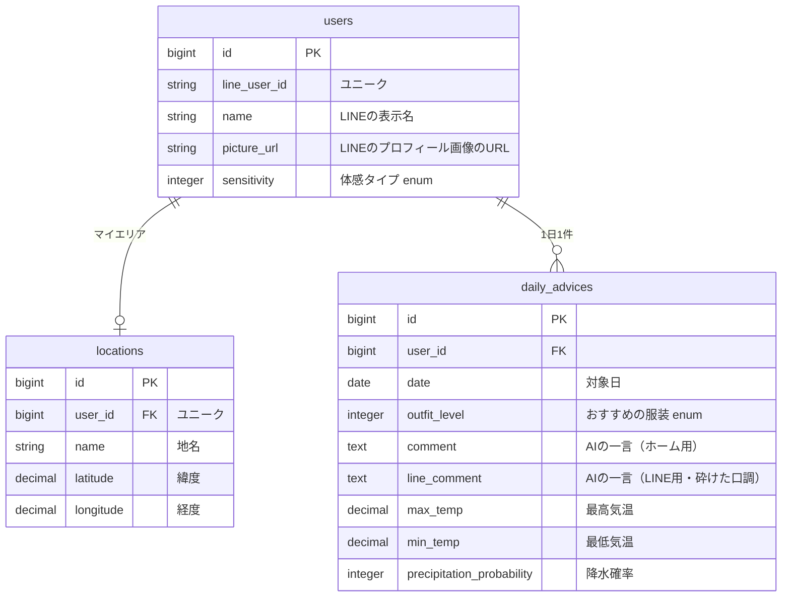

# 今日なに着てく？

毎朝7時に、今日の天気に合わせた服装アドバイスをLINEに届けるアプリです。
地名を検索すれば、ログインなしでも今日の天気と服装の目安を確認できます。

## 作成理由

複数のAPIをつないで「人の代わりに自動で動く仕組み」を作ってみたかったため。
あわせて、毎朝「何着よう」とお天気アプリを開く手間をなくすことが目的です。

## 主な機能（MVP）

- 地名検索で、その地点の今日の天気とおすすめの服装を表示（ログイン不要）
- トップページの初期表示は渋谷区
- LINEログインすると、AIによる一言アドバイスも見られる
- LINEログイン
- マイエリア（毎朝の天気を届ける場所。1つ、自宅や職場を想定）と体感タイプ（暑がり／ふつう／寒がり）の設定
- 毎朝7時に、天気・おすすめの服装・AIの一言をLINEで通知

## 仕組み

```
⏰ 毎朝7:00（Solid Queue の定期実行）
   ↓
☁️ ユーザーごとに天気を取得（Open-Meteo）
   ↓
👕 おすすめの服装（6パターン）と傘・暑さ注意のマークをルールで判定
   ↓
🤖 判定結果をもとにAIが一言アドバイスを生成（Gemini API）
   ↓
📱 LINEに通知（LINE Messaging API）
```

服装とマークはルールで判定し、AIには一言コメントの生成を任せる。

## 画面

| 画面 | 内容 |
|---|---|
| トップ | 地名検索、今日の天気・おすすめの服装、LINEログインボタン |
| ホーム | マイエリアの今日の天気・服装・AIの一言、通知状況 |
| 設定 | マイエリア、体感タイプ、LINE通知の状態、ログアウト |

## ER 図



## 使用技術

| 役割 | 技術 |
|---|---|
| フレームワーク | Ruby on Rails |
| データベース | PostgreSQL（Neon） |
| ホスティング | Render |
| 定期実行 | Solid Queue（recurring tasks） |
| 天気 | Open-Meteo API |
| 地名検索 | 国土地理院 地名検索API |
| 文章生成 | Gemini API |
| ログイン・通知 | LINEログイン / LINE Messaging API |

## 設計判断

「なぜそうしたか」は [docs/design-decisions.md](docs/design-decisions.md) にまとめています。
